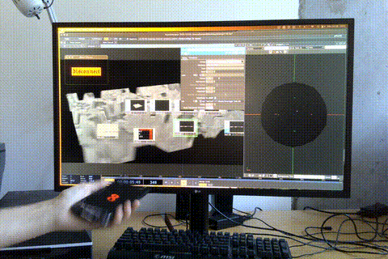

# collective behavior
ʎq ƃuıddoʇs ɹoɟ noʎ ʞuɐɥʇ : ɟɐ ssǝɹƃoɹd uı sı ǝɯpɐǝɹ sıɥʇ : ǝʇou

☆ *let audiences affect your interactive art pieces in real time using their phones with no app downloads or unnecessary overhead.* ☆



**table of contents** <a name="toc"></a>

 1. [motivation](#motivation)
 2. [goal / what i want it to do](#goal)
 3. [architecture & why i made the decisions i did with the goals i had in mind](#arch)
	 1. [ideal specifications](#specs)
	 2. why am i using socket.io vs udp if socket.io uses tcp under the hood, and introduces delays, when in-order delivery is not something i care about
4. [process](#process)
	1. [where it’s at rn](#where)
	3. [challenges](#challenges)
	4. [future updates](#updates)
5. [demo](#demo)
6. [instructions to run it](#runit)
7. [sus circumstances / questions i'm asking myself](#sus)
8. [contact](#contact)

## motivation <a name="motivation"></a>
i'm interested in exploring audience interaction in live digital art.

one way an audience can affect a work in real time is using the devices / phones they carry, which are equipped with a number of sensors, cameras, and microphones.

concepts i'm interested in exploring with these [ including and not limited to ] :

1. collective action and decision making / swarm behaviour
2. agency over environment . agency
3. access
4. visibility

the desire to make this progressed naturally from a piece i created called "surveil yourself" where audiences could use their phone cameras to join a live video feed projected on the walls of a gallery space.

i got inspired by seeing how engaged people became when they could directly affect what they saw.

[↑ table of contents](#toc)

## goal <a name="goal"></a>

my goal for this is to create a general all-purpose type tool that digital artists, including myself, could use to explore interaction and / or collective decision making.

i want it to be relatively accessible for people to use. i'm not yet going off standards, i'm just thinking along the lines of :


1. audiences shouldn't need to download apps, or anything else, to engage with the art.
2. it should be intuitive. requiring little to no explanation to use.
3. artists should be able to integrate this into their setups, if they so choose, without needing to know how to code.

live visual tools such as touch designer, max / msp, and unity seem to favour osc [ open sound control ] for communication.

given this, there's redundancy in the way data gets sent, but i'm not yet sure if that's a problem.

[↑ table of contents](#toc)

## architecture <a name="arch"></a>
### ideal specifications <a name="specs"></a>
the above goals turned into the following specifications :

1. the interface should be a simple to use web application compatible with the x most popular phones (covering x% of the population) and be functional on the x most used phone browsers (safari, chrome, firefox).
2. the link can be delivered via a qr code at an event, or by a simple link
3. an artist should be able to control the system from one desktop gui application that's simple to use
	1. the front end should be customizable (in terms of what sensors an artist wants to integrate) from the desktop application
	2. it should configure a custom front end, navigable by an id unique to their exhibit
	   - url format: `/exhibit/:id`
	4. it should allow them to specify the port they want to use for osc
4. uptime and downtime specs (to create)
### current components
| component                 | description                                                               | technologies            |
|--------------------------|---------------------------------------------------------------------------|------------------------------|
| **mobile web client**     | web app accessed via url / qr code. captures accelerometer data. served via vercel.    | html, js, socket.io, vercel |
| **socket bridge server**  | receives sensor data and routes to artist control system via socket.io.  | node.js, socket.io  |
| **desktop gui**     | electron app sends sensor data to artist's local port via osc protocol. wip : to configure and monitor inputs, choose sensors. | electron    |

[↑ table of contents](#toc)

## process <a name="process"></a>
#### where it's at rn<a name="where"></a>
- phones → socket.io → electron → osc [ single exhibit ]
- accelerometer integration
	- currently averages collective data
- qr / simple link distribution  [ manual ]
#### challenges <a name="challenges"></a>
- many... that i will enunciate later
#### future updates <a name="updates"></a>
- handle separated data [ not a single average ]
- additional sensor integration
- define sensors + osc ports in the electron gui
- per-exhibit ids and config-backed frontend
- multiple exhibits concurrently [ rooms / namespaces ]

**later future**
- nicer mobile ui
- analytics / logging dashboard
- auth / roles
- web ui alternative to electron [ maybe ]

[↑ table of contents](#toc)

## demo <a name="demo"></a>
## want to run it? <a name="runit"></a>
steps to test this out semi locally
1. clone this repo
2. navigate to the app directory and run the electron app

    ```
    cd app
    npm install
    npm start
    ```

3. accelerometer data gets sent to port 8000 right now. so in whatever program you want to use, navigate there and specify that port for osc in.
4. open the following link on your phone [phone-shaker.vercel.app](https://phone-shaker.vercel.app)
5. watch it show up in your program

[ if it doesn't, [let me know](#contact) ]

[↑ table of contents](#toc)

## sus circumstances / questions i'm asking myself <a name="sus"></a>
1. why am i using an electron gui when it is a redundancy af?
    1. potentially i could ... just have a front end display. but ....... would it be as easily customizable?
## contact <a name="contact"></a>
got any thoughts? insight? words?
hit me up at :

c_4@gmx.com

[↑ table of contents](#toc)
